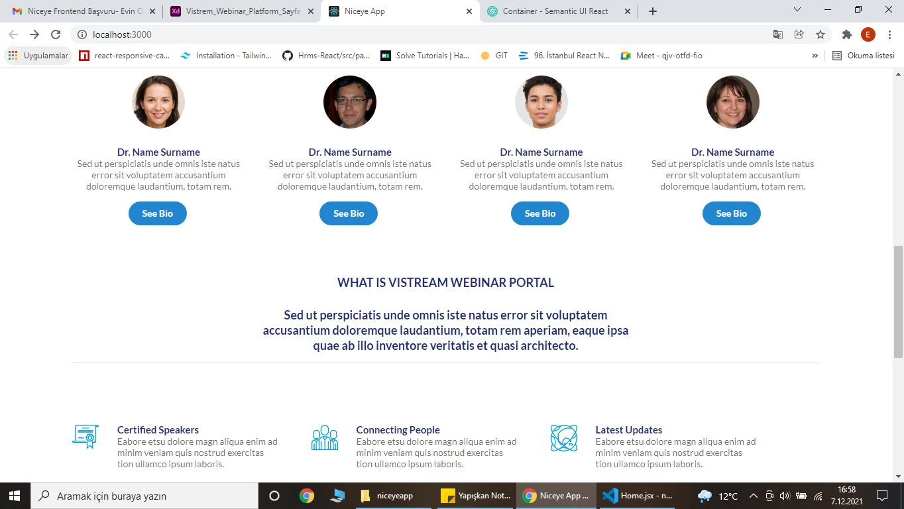

 ### Niceye App
<div>





</div>

## Projenin Çalıştırılması
Proje indirildikten veya forkladıktan sonra, 'Visual Studio Code' editörü ile proje açılır. 

  Terminalde;
```
npm install

```
ardından
```
npm start
```
Proje tarayıcıda açılmış olur.

